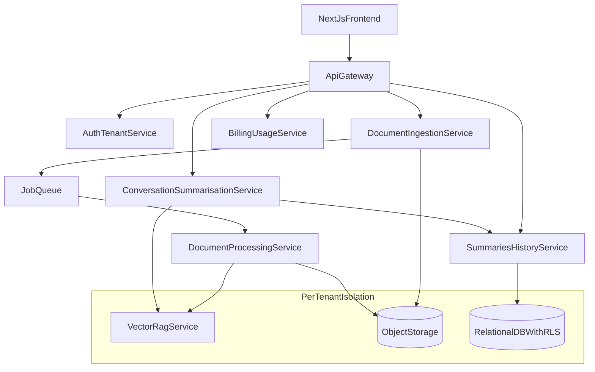

## KwaniTech Generationali – Microservice Architecture

### 1. Purpose & guiding principles

- **Objective**: Evolve the current monolithic Next.js + UploadThing + Clerk app into a **microservice-based platform** that guarantees **per-lawyer (tenant) isolation** for documents, embeddings, and AI outputs, while keeping the existing UX direction.
- **Primary driver**: Support **individualised learning** where each lawyer (or firm) has a **private knowledge base** and the system never leaks client data across tenants.
- **Key properties**:
  - **Strong tenant isolation** at every layer (storage, vector store, DB, caches, logs).
  - **Clear service boundaries** so ingestion, processing, RAG, and UI can evolve independently.
  - **Auditable, explainable data flows** that legal/security stakeholders can understand and trust.
  - **Incremental migration** from today’s single Next.js app to a service-oriented backend.

---

### 2. High-level system view

At a high level, the system consists of:

- A **Next.js frontend** for all user-facing pages (marketing, upload, dashboard, chat).
- An **API Gateway / Backend-for-Frontend (BFF)** as the single entrypoint for the frontend.
- A set of **backend microservices** responsible for auth/tenancy, document ingestion and parsing, vector storage & retrieval, summarisation/chat orchestration, history, billing, and observability.

High-level architecture:

---

### 3. Services and boundaries

This section defines the **responsibilities**, **data ownership**, and **external APIs** for each service. All APIs shown are conceptual; concrete protocols (REST, gRPC) can be chosen per environment.

#### 3.1 API Gateway / Backend-for-Frontend (BFF)

- **Responsibilities**
  - Single entrypoint for the Next.js app and future clients.
  - Verify external identity (via Clerk-provided token).
  - Resolve `userId` and `tenantId` using the Auth & Tenant Service.
  - Enforce basic cross-cutting policies (rate limits, plan limits, basic authorization checks).
  - Aggregate data from multiple backend services into frontend-oriented responses.
- **Does not own**
  - Long-lived domain data (documents, summaries, embeddings, billing records).
  - Any heavy business logic; it delegates to domain services.
- **Example external APIs**
  - `GET /me` → returns current user/tenant profile.
  - `GET /me/documents` → proxies to Document Ingestion Service.
  - `GET /me/summaries` → proxies to Summaries & History Service.
  - `POST /me/summaries` → calls Conversation & Summarisation Orchestrator to create a summary.
  - `GET /me/usage` → proxies to Billing & Usage Service.
- **Key invariants**
  - Every downstream call includes a trusted `tenantId` and `userId` derived from validated identity.
  - Never trusts arbitrary `tenantId` from the browser.

#### 3.2 Auth & Tenant Service

- **Responsibilities**
  - Maintain **internal identities** and **tenant structure**.
  - Map external auth provider identifiers (e.g. Clerk `user.id`) to internal `User` and `Tenant`.
  - Issue **internal service tokens** or claims (e.g. JWT) that include `tenantId`, `userId`, and roles.
- **Owns**
  - `User` records.
  - `Tenant` records (e.g. individual lawyer or law firm).
  - `Membership` records tying users to tenants with roles.
  - Role definitions (e.g. `LAWYER`, `ADMIN`, `PARALEGAL`).
- **Example APIs**
  - `POST /auth/resolve` – input: external token (from Clerk), output: `{ userId, tenantId, roles }`.
  - `GET /tenants/{tenantId}` – return tenant metadata.
  - `GET /users/{userId}/memberships` – list memberships across tenants if needed.
- **Key invariants**
  - There is always a well-defined `tenantId` for every request that touches private knowledge.
  - Other services never parse external tokens directly; they trust the gateway + this service.

#### 3.3 Document Ingestion Service

- **Responsibilities**
  - Own the lifecycle of documents **after upload** and before/after parsing.
  - Track status (e.g. `UPLOADED`, `PARSING`, `PARSED`, `FAILED`).
  - Kick off background jobs for parsing.
- **Owns**
  - `Document` records.
  - The mapping from document IDs to storage locations in object storage.
- **Example data model**
  - `Document(id, tenantId, userId, storageUrl, originalFilename, mimeType, sizeBytes, status, createdAt, updatedAt)`
- **Example APIs**
  - `POST /tenants/{tenantId}/documents` – called by UploadThing webhook / handler with file URL + metadata.
  - `GET /tenants/{tenantId}/documents` – list documents for dashboard / debug.
  - `GET /tenants/{tenantId}/documents/{id}` – get document status and metadata.
  - **Internal**: emits jobs to `JobQueue` like `ParseDocument { documentId, tenantId }`.
- **Key invariants**
  - Every `Document` row is associated with exactly one `tenantId`.
  - Only the owning tenant can see or operate on its documents.

#### 3.4 Document Processing / Parsing Service

- **Responsibilities**
  - Download raw files from object storage.
  - Convert PDFs (and future formats) into cleaned text and structured chunks.
  - Forward chunks to the Vector Store & RAG Index Service for embedding and indexing.
- **Owns**
  - The **parsing pipeline** and transformation logic.
  - Transient parsing artifacts (if any) but not long-term storage of raw files or embeddings.
- **Example APIs & jobs**
  - Consumes jobs from `JobQueue`:
    - `ParseDocument { documentId, tenantId }`.
  - Calls Vector Store & RAG Index Service:
    - `POST /tenants/{tenantId}/documents/{documentId}/chunks`.
  - Calls Document Ingestion Service:
    - `POST /internal/documents/{documentId}/parsed` or `.../failed`.
- **Key invariants**
  - Never persists long-lived tenant data outside what’s needed for parsing.
  - All parsing and chunking is done in the context of a single tenant.

#### 3.5 Vector Store & RAG Index Service

- **Responsibilities**
  - Own embeddings and retrieval logic across all tenants.
  - Provide RAG-ready retrieval for summarisation and chat.
- **Owns**
  - Embedding vectors **per tenant**.
  - Any metadata stored alongside chunks (e.g. `documentId`, `pageNumber`, `section`, tags).
- **Example APIs**
  - `POST /tenants/{tenantId}/documents/{documentId}/chunks`
    - Body: list of `{ chunkId?, text, metadata }`.
    - Behavior: embeds text, writes vectors into tenant’s index.
  - `POST /tenants/{tenantId}/query`
    - Body: `{ query, topK, filters? }`.
    - Behavior: performs similarity search only within tenant’s index.
- **Key invariants**
  - No API can query across tenants; each request is scoped to **exactly one `tenantId`**.
  - The service enforces tenant isolation internally (see section 5).

#### 3.6 Conversation & Summarisation Orchestrator Service

- **Responsibilities**
  - Orchestrate RAG summarisation and conversational interactions.
  - Implement system prompts and guardrails tailored to South African legal context (and others in future).
  - Persist outputs via Summaries & History Service.
- **Owns**
  - Orchestration flows (e.g. how many retrieval rounds, prompt templates).
  - Business logic around summarisation vs general Q&A, limits per plan, etc.
- **Example APIs**
  - `POST /tenants/{tenantId}/summaries`
    - Body: e.g. `{ documentId, question?, mode: "full" | "brief" }`.
    - Steps:
      1. Verify caller identity and tenant membership (via gateway token).
      2. Fetch document metadata from Document Ingestion Service.
      3. Query Vector Store for relevant chunks.
      4. Call LLM provider with system prompt + retrieved context.
      5. Persist result via Summaries & History Service.
      6. Return summary ID and status.
  - `POST /tenants/{tenantId}/chat`
    - Body: `{ conversationId?, message, contextScope: "all" | "document", documentId? }`.
    - Behavior: RAG-augmented chat over tenant’s knowledge base.
- **Key invariants**
  - Never uses context from another tenant’s data.
  - Always scopes retrieval to the tenant-specific index.

#### 3.7 Summaries & History Service

- **Responsibilities**
  - Persist and serve summarisation outputs and conversation history.
  - Provide efficient listing and retrieval for dashboards and detail views.
- **Owns**
  - `Summary` records and (optionally) `Conversation` and `Message` records.
- **Example data models**
  - `Summary(id, tenantId, documentId, title, shortSummary, fullSummary, createdAt, createdBy)`
  - `Conversation(id, tenantId, createdAt, createdBy, title?)`
  - `Message(id, conversationId, tenantId, role, content, createdAt)`
- **Example APIs**
  - `GET /tenants/{tenantId}/summaries`
  - `GET /tenants/{tenantId}/summaries/{id}`
  - `GET /tenants/{tenantId}/conversations`
  - `GET /tenants/{tenantId}/conversations/{id}`
- **Key invariants**
  - All rows are tenant-scoped and protected via DB-level and service-level checks.

#### 3.8 Billing & Usage Service

- **Responsibilities**
  - Integrate with Stripe (or equivalent) for subscriptions and payments.
  - Track usage per tenant (uploads, tokens, summaries, chats).
  - Enforce plan limits in collaboration with the gateway and domain services.
- **Owns**
  - `Plan`, `Subscription`, `UsageRecord` data.
- **Example APIs**
  - `GET /tenants/{tenantId}/usage`
  - `GET /tenants/{tenantId}/subscription`
  - Webhooks endpoints for Stripe events (e.g. subscription created/updated/cancelled).
- **Key invariants**
  - Billing data is also tenant-scoped but does not leak document content.

#### 3.9 Audit & Observability Service

- **Responsibilities**
  - Receive structured events from other services.
  - Centralize logs, metrics, and traces without storing sensitive content.
- **Owns**
  - Audit event records, operational metrics.
- **Example events**
  - `SummaryCreated { tenantId, userId, summaryId, documentId, timestamp }`
  - `DocumentAccessed { tenantId, userId, documentId, purpose, timestamp }`
- **Key invariants**
  - Never stores raw document text or full summaries.
  - Enables legal-grade auditability without compromising confidentiality.

---

### 4. Tenancy model & identity flow

#### 4.1 Core entities

- **Tenant**
  - Represents an organisational boundary for confidentiality:
    - A solo practitioner (individual lawyer), or
    - A law firm, or
    - A team within a larger organisation.
  - Key fields: `id`, `name`, `jurisdiction`, `createdAt`, `billingPlan`, etc.

- **User**
  - Represents a person using the system, identified primarily via Clerk.
  - Key fields: `id`, `externalProvider`, `externalUserId` (e.g. Clerk ID), `email`, `name`.

- **Membership**
  - Links `User` to `Tenant` with a role.
  - Key fields: `id`, `userId`, `tenantId`, `role`, `createdAt`.

#### 4.2 Mapping Clerk identities

1. **Browser → Clerk**  
   - The frontend uses Clerk to authenticate users and obtains a **verified session token** (JWT) from Clerk.

2. **Frontend → API Gateway**  
   - Every API request from the frontend includes the Clerk token in headers (e.g. `Authorization: Bearer <token>`).

3. **API Gateway → Auth & Tenant Service**
   - Gateway validates the token with Clerk (or via JWKS).
   - Gateway calls **Auth & Tenant Service** with the external user ID (from token) to resolve:
     - `userId` (internal),
     - `tenantId` (default or selected),
     - `roles` for that tenant.
   - Auth & Tenant Service may:
     - Create `User` and `Tenant` records lazily on first login.
     - Support multiple memberships but require the gateway to choose an active tenant per request (e.g. from header or subdomain).

4. **Internal tokens**
   - Auth & Tenant Service or the Gateway issues an **internal token** (e.g. short-lived JWT) with claims:
     - `sub` = internal `userId`
     - `tenantId`
     - `roles`
   - This token is attached to downstream service calls and is **not** exposed to the browser.

#### 4.3 Tenant propagation

- Every internal request between services includes the **internal token** or equivalent metadata.
- Services **do not** accept an arbitrary `tenantId` from request bodies or query parameters as trustable without the internal token.
- When a service writes data (documents, chunks, summaries, usage), it uses the `tenantId` from the trusted claims.

---

### 5. Vector store & RAG isolation strategy

To faithfully deliver **individualised learning** and strong confidentiality, we explicitly choose the following strategy.

#### 5.1 Decision: per-tenant collections as the default

- **Primary decision**: For KwaniTech’s legal use case, the Vector Store & RAG Index Service uses **per-tenant collections** (or equivalent isolation in the underlying vector DB).
  - Each `tenantId` has its **own logical index** (e.g. separate collection, namespace, or schema).
  - Chunks from one tenant are never stored in a collection shared with another tenant’s data.
- **Rationale**:
  - Easier to **reason about isolation** for legal/security reviews.
  - Simplifies data deletion (drop a collection to fully erase a tenant).
  - Reduces risk of accidental cross-tenant queries caused by misconfigured filters.

#### 5.2 Ingestion rules

- The service exposes:
  - `POST /tenants/{tenantId}/documents/{documentId}/chunks`
    - Internally routes to the **tenant-specific collection**.
- Validation:
  - Ensures the `tenantId` in the internal token matches the `tenantId` in the path.
  - Rejects any attempt to write chunks for another tenant.

#### 5.3 Query rules

- The service exposes:
  - `POST /tenants/{tenantId}/query`
    - Operates **only** on that tenant’s collection.
    - Optional filters (e.g. `documentId`, tags, date ranges) are applied **within** the tenant’s collection.
- There is **no API** that allows:
  - Querying across all tenants, or
  - Passing in a list of tenant IDs for multi-tenant retrieval.

#### 5.4 Shared or public knowledge

- If the system later uses **generic legal knowledge** (e.g. public statutes, case law), that data is:
  - Stored in a **separate, readonly collection** (e.g. `public_law_index`).
  - Queried explicitly by the orchestrator as a separate step.
  - Combined in prompts in a way that **does not affect** or blend private, tenant-specific embeddings.
- This separation ensures:
  - Tenant embeddings remain private and unaffected by updates to public data.
  - Public knowledge can be updated independently.

---

### 6. Frontend integration (Next.js)

The existing Next.js app remains the primary UI. Only the **backend integration points** change.

#### 6.1 Upload flow

1. User signs in with Clerk and navigates to the upload page.
2. Frontend uses UploadThing to send the PDF directly to object storage.
3. UploadThing’s **server-side handler** (running in the Next.js environment or a lightweight backend) sends a **webhook** or API call to:
   - `POST /tenants/{tenantId}/documents` on the API Gateway.
4. API Gateway:
   - Resolves `tenantId` via Auth & Tenant Service.
   - Forwards the call to Document Ingestion Service.
5. Document Ingestion Service:
   - Creates a `Document` record.
   - Emits `ParseDocument` job to the queue.
6. Parsing + vectorisation + summarisation happen asynchronously in backend services.
7. The upload page:
   - Polls `GET /me/documents/{id}` or `GET /me/summaries?documentId=...`
   - Or subscribes to status updates (future enhancement via WebSockets or SSE).

#### 6.2 Dashboards & detail views

- `/dashboard`
  - Calls `GET /me/summaries` on the gateway.
  - Gateway proxies to Summaries & History Service scoped by `tenantId`.
  - Renders a list of summaries, with links to detail pages.

- `/summaries/[id]`
  - Calls `GET /me/summaries/{id}` on the gateway.
  - Gateway proxies to Summaries & History Service, again with enforced `tenantId`.
  - Optionally shows related documents and chat options.

#### 6.3 Chat / “descendants” view

- A chat UI uses `POST /me/chat` (gateway → Conversation & Summarisation Orchestrator).
- The orchestrator calls Vector Store & RAG Index Service using the tenant-specific index and returns AI responses that:
  - Are grounded in the **tenant’s own documents and prior summaries**.
  - Optionally draw from public legal knowledge, kept strictly separate.

---

### 7. Migration plan from current Next.js app

This section outlines a **phased migration** from the current monolithic Next.js + UploadThing + Clerk app to the microservice architecture, without breaking the UX.

#### Phase 0 – Baseline assessment

- Identify current entrypoints and flows:
  - Upload route (`app/api/uploadthing/*`).
  - Upload page (`app/(logged-in)/upload/page.tsx`).
  - Planned dashboard and summary pages (to be created).
- Document current dependencies:
  - Clerk integration (auth).
  - UploadThing (uploads).
  - LangChain + `pdf-parse` (currently unused).

#### Phase 1 – Introduce clear internal boundaries

- Inside the current Next.js app:
  - Extract summarisation-related logic (currently TBD) into separate internal modules:
    - `services/documents` – mimics Document Ingestion Service APIs.
    - `services/summaries` – mimics Summaries & History Service APIs.
    - `services/rag` – mimics Vector Store & RAG Index Service APIs.
  - Introduce **domain-specific types**:
    - `TenantId`, `UserId`, `DocumentId`, `SummaryId`.
    - Use these types consistently rather than plain strings where possible.
- Outcome:
  - The monolith still runs as a single app, but its internal architecture mirrors the future microservices.

#### Phase 2 – Stand up core backend services

- Implement **Document Ingestion Service** and **Summaries & History Service** as separate deployable units:
  - Initially, they can share the same physical database as the Next.js app (or use their own schemas).
  - Expose their APIs over HTTP or gRPC.
- Modify the Next.js app:
  - Replace internal `services/documents` and `services/summaries` modules with **API clients** that call the new services via the API Gateway.
  - Keep parsing and summarisation still in-process for now if needed, but route data through the new services.
- Outcome:
  - Documents and summaries are now owned by dedicated services; the frontend still works as before.

#### Phase 3 – Externalize vector store & RAG

- Stand up the **Vector Store & RAG Index Service**:
  - Configure the chosen vector database (e.g. Qdrant, Weaviate, pgvector).
  - Implement per-tenant collections as per section 5.
- Move embedding + retrieval logic:
  - Remove direct embedding calls from the Next.js app (if any).
  - Make Document Processing / Parsing Service call the Vector Store via its API for ingestion.
  - Make Conversation & Summarisation Orchestrator call the Vector Store for retrieval.
- Outcome:
  - RAG responsibilities are fully isolated and tenant-aware.

#### Phase 4 – Harden multi-tenancy & security

- Apply RLS (row-level security) to relational databases:
  - Ensure every query is constrained by `tenantId`.
  - Enforce checks via policies, not just application code.
- Tighten auditing:
  - Ensure all accesses to documents, summaries, and conversations emit audit events.
  - Integrate services with Audit & Observability Service.
- Review and enforce:
  - No service accepts unvalidated `tenantId` from client input.
  - Internal tokens and mTLS (if used) between services for stronger trust boundaries.

#### Phase 5 – Billing and advanced features

- Introduce **Billing & Usage Service**:
  - Connect pricing section in the frontend to real checkout flows (e.g. Stripe).
  - Track per-tenant usage and enforce quotas (uploads/month, tokens/month, max document size).
- Add advanced features on top of the isolated base:
  - Team sharing within a tenant (e.g. multiple lawyers in a firm).
  - Jurisdiction-aware models and prompts (e.g. different jurisdictions per tenant).
  - Export/audit features for compliance reviews.

---

### 8. Summary

- The system is organised around **clear microservice boundaries**: Gateway, Auth & Tenant, Document Ingestion, Document Processing, Vector Store & RAG, Conversation & Summarisation, Summaries & History, Billing & Usage, and Audit & Observability.
- **Tenant isolation** is enforced at every layer via per-tenant collections in the vector store, tenant-scoped schemas in relational DBs, and strict propagation of trusted `tenantId` in internal tokens.
- The **Next.js frontend** remains the main user experience, now backed by an API Gateway that orchestrates calls to the microservices.
- A **phased migration plan** allows moving from the existing monolith to this architecture without disrupting current development or users.

