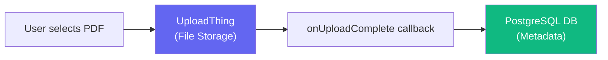

# What Changed & Do You Still Need UploadThing?

## What We Changed

We migrated your database backend from **local SQLite** to **remote PostgreSQL** via Prisma Accelerate.

| Area | Before | After |
|---|---|---|
| Database provider | SQLite (`file:./data/generationali.db`) | PostgreSQL via Prisma Accelerate |
| Connection config | Hardcoded file path in `schema.prisma` | `env("DATABASE_URL")` in `schema.prisma`, value in `.env.local` |
| Tables | Existed locally in the SQLite file | Created remotely via `npx prisma db push` |

### Files Modified

- [schema.prisma](file:///c:/usr/Ktechgravity/Generationali/apps/web/prisma/schema.prisma) — Provider changed from `sqlite` → `postgresql`, URL now reads from `DATABASE_URL` env var.
- [.env.local](file:///c:/usr/Ktechgravity/Generationali/apps/web/.env.local) — Added `DATABASE_URL` with your Prisma Accelerate connection string.

---

## Do You Still Need UploadThing? **Yes.**

UploadThing and the database serve **two completely different purposes** in your upload pipeline:

| Layer | Tool | What It Stores |
|---|---|---|
| **File Storage** | UploadThing | The actual PDF binary (blob). Returns a `storageUrl` and `storageKey`. |
| **Metadata** | PostgreSQL (Prisma) | A `Document` record: filename, size, mime type, who uploaded it, status, and a pointer (`storageUrl`) back to the file in UploadThing. |

### How the flow works in your code

1. **User uploads a PDF** → [UploadForm.tsx](file:///c:/usr/Ktechgravity/Generationali/apps/web/components/upload/UploadForm.tsx) calls `startUpload()` which sends the file to UploadThing.
2. **UploadThing stores the file** and triggers the `onUploadComplete` callback in [core.ts](file:///c:/usr/Ktechgravity/Generationali/apps/web/app/api/uploadthing/core.ts).
3. **The callback saves metadata to Postgres** by calling `createDocument()` and `createSummary()` — storing the file's URL, key, name, size, etc.

> [!IMPORTANT]
> **Removing UploadThing would break file uploads entirely.** The database does not store the actual PDF file — it only stores a reference to where UploadThing is hosting it. Both layers are essential.

### TL;DR

- ✅ **UploadThing** = stores your actual PDF files (blob storage)
- ✅ **PostgreSQL** = stores metadata *about* those files (who uploaded, when, status, URL pointer)
- 🚫 They are **not** interchangeable — you need both

---

# AI PDF Summarization & Auto-Fix (2026-03-10)

## What We Added

We replaced placeholder summaries with a functional AI pipeline and added a mechanism to "heal" old documents.

### 1. Build Fix: LangChain Modernization
We resolved a `Module not found` error by updating the LangChain text splitter import.
- **Old**: `langchain/text_splitter`
- **New**: `@langchain/textsplitters`

### 2. "Lazy" AI Summarization
Documents uploaded before the AI was connected used to show a placeholder. Now, visiting an old summary page triggers an automatic background process:
- **Detection**: [SummaryAutoFix.tsx](file:///c:/usr/Ktechgravity/Generationali/apps/web/components/summaries/SummaryAutoFix.tsx) identifies placeholder text.
- **Action**: Triggers [summarizeDocumentAction](file:///c:/usr/Ktechgravity/Generationali/apps/web/lib/actions/summarize.ts).
- **Update**: The DB is updated with real Gemini-generated content and the document status moves to `PARSED`.

### 3. Core AI Engine
- **Service**: [ai.ts](file:///c:/usr/Ktechgravity/Generationali/apps/web/lib/services/ai.ts) now handles the full PDF-to-summary flow (Download → Parse → Chunk → Summarize).
- **Status Sync**: Document status now correctly reflects the processing state.

---

## Roadmap & Next Steps

With Phase 1 (Next.js Monolith) nearing completion, here is the immediate focus:

| Priority | Feature | Description |
|---|---|---|
| 🥇 **RAG Integration** | Vector Search | Index chunks into a vector store (e.g., Pinecone/pgvector) for Retrieval Augmented Generation. |
| 🥈 **Chat Interface** | Document Q&A | Add a chat sidebar to `/summaries/[id]` to allow lawyers to ask specific questions about the PDF. |
| 🥉 **Post-Upload Flow** | UX Polish | Automatically redirect users to the summary page immediately after a successful upload. |
| 4 **Phase 2 Prep** | Microservices | Begin extracting parsing and summarization logic into the scaffolded `services/` directory. |
